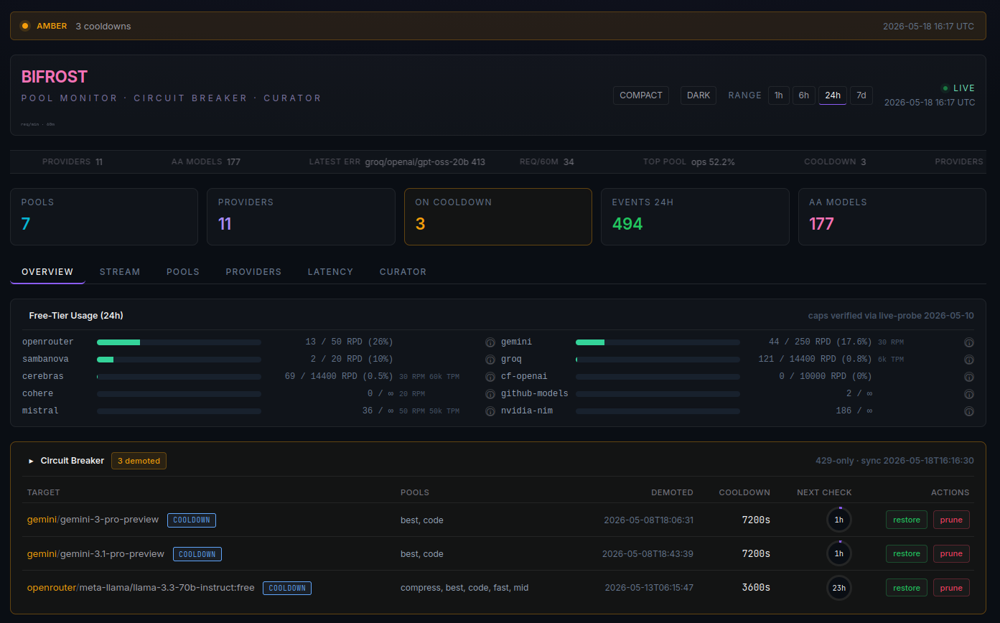
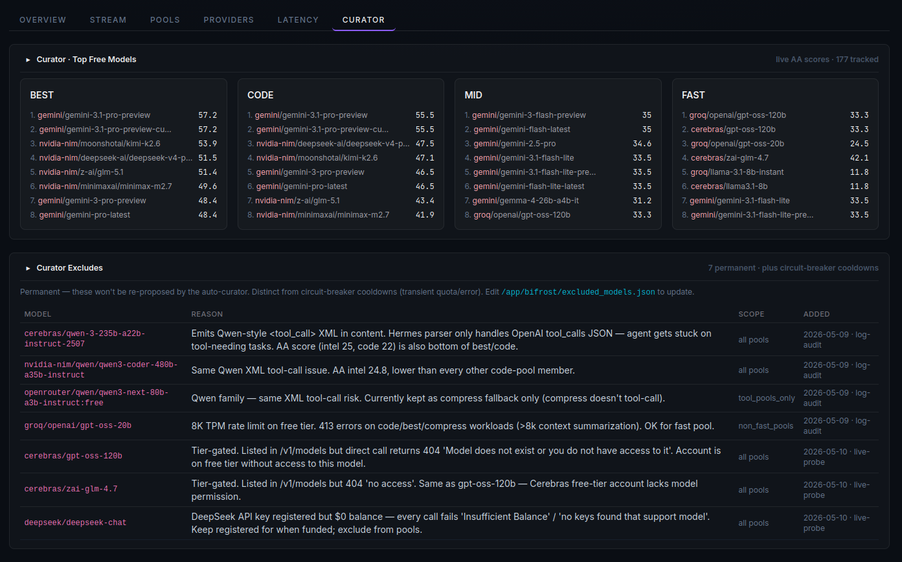

# CoireAnsic

> *Coire Ansic* — Irish: "the un-dry cauldron." The Dagda's magic cauldron
> from the Tuatha Dé Danann mythology that never emptied; nobody left
> hungry, no matter how many came to feast.

A **self-managing free-tier LLM router**. Aggregates 10+ free-tier providers
behind one OpenAI-compatible endpoint, with adaptive routing, a circuit
breaker, and an autonomous operator layer that keeps the stack healthy
without you babysitting it.

Stick any client in front (your own code, [hermes-agent], [OMP], LangChain,
plain `curl`) and get cheap-or-free model access with automatic failover.

[hermes-agent]: https://github.com/NousResearch/hermes-agent
[OMP]: https://github.com/example/omp

---

## Why

Free-tier inference is great but fragile:
- Every provider has different RPM/RPD/TPM caps
- Caps shift monthly (new providers, EOL'd models, rate-limit changes)
- A single hammered provider takes down your whole agent
- You waste time babysitting which provider has budget today

This project routes across all of them, fails over automatically when one
saturates, and adapts its own weights daily based on what actually worked.
You add keys; it figures out the rest.

## Dashboard

Pool health, per-provider free-tier usage (RPD/TPM), live circuit-breaker
state with restore/prune actions, latency P50/P95 per pool, and a curator
view of which models are excluded and why.





`http://localhost:9118` after `./install.sh`. Profile-gated — start with
`docker compose --profile dashboard up -d` if you stopped it.

## Core (always installed)

| Component | Port | Role |
|---|---|---|
| **Bifrost** | 4001 | LLM gateway. 10 providers, 7 pools, weighted routing + fallback chains |
| **strip-shim** | 4002 | OpenAI-compat wrapper. Normalises `reasoning_content` + tool-call IDs for Mistral/Cerebras |
| **dashboard** | 9118 | Pool health, demoted state, CB cooldowns, latency P50/P95, usage estimates |
| **circuit-breaker** | systemd | Real-time 429/timeout watchdog. Demotes broken targets, smoke-tests recovery |
| **cb-deadman** | systemd 2min | Restarts CB if it dies |
| **pi-op-react** | systemd 60min | Pi-mono operator: recovers stuck demotes via dashboard API |
| **pi-op-health** | systemd hourly | Read-only status audit → JSONL log |
| **pi-op-queue** | systemd 5min | Auto-onboards keys dropped in `~/.coire/operator/incoming_keys/` |
| **pi-op-patch** | systemd daily | Reconciles upstream patches (e.g. hermes-agent updates) |
| **op-rebalance** | systemd daily | Adaptive weights — saturated providers down, idle providers up |
| **op-discover** | systemd weekly | Scans provider `/v1/models`, surfaces new candidates |

### Pools (`scripts/runtime/pool_weights.yaml`)

| Pool | Intent | Example targets |
|---|---|---|
| `best` | Top-IQ user calls | kimi-k2.6 / gpt-4.1 / mistral-medium / DeepSeek-V3.1 |
| `code` | Code + reasoning | kimi-k2.6 / gpt-4.1 / codestral / cf-qwen-coder |
| `compress` | Long-context summarization | nvidia llama-70b / mistral-medium / groq llama-70b |
| `fast` | Low-latency 8b | cerebras + groq llama-8b / gpt-4o-mini / gemini-flash-lite |
| `mid` | Balanced workhorse | gpt-4.1-mini / gemini-3-flash / mistral-small |
| `vision` | Multimodal | gemini-flash / nvidia llama-vision / mistral pixtral |
| **`ops`** | **Operator-only isolation** | cerebras + groq 8b + nvidia llama-70b (huge unmetered RPD) — pi-op routes here so it can't eat user-pool budgets |

## Optional adapters (opt-in)

| Flag | What it adds |
|---|---|
| `--with-hermes` | [Nous hermes-agent] CLI + gateway + free-provider scout cron + OpenAI-compat HTTP at `:8642` (api_server platform) for chat UIs |
| `--with-telegram` | Telegram bot pairing (requires `--with-hermes`) |
| `--with-firecrawl` | Local web_extract backend |
| `--with-searxng` | Self-hosted meta-search |
| `--with-webui` | [Open WebUI](https://github.com/open-webui/open-webui) chat client — single container, OpenAI-compat, auto-points at strip-shim. UI at `http://localhost:3030` (override via `OPENWEBUI_PORT` in `.env`). |
| `--with-camofox` | Anti-detect Firefox — **BYO source**, see [camofox/README.md](camofox/README.md). Not in `--all`. |
| `--all` | hermes + telegram + firecrawl + searxng + webui (camofox is opt-in only) |

[Nous hermes-agent]: https://github.com/NousResearch/hermes-agent

## Install

```bash
git clone <this-repo> coire-ansic
cd coire-ansic
cp .env.example .env
$EDITOR .env                  # paste at least one provider key
./install.sh                   # core only
# or:
./install.sh --with-hermes --with-firecrawl
./install.sh --all
```

Idempotent — re-run safely.

### Remote install

`install.sh` runs locally on the box that will host the stack. To install
on a remote server, ssh in and clone there:

```bash
ssh user@server
git clone https://github.com/<owner>/coire-ansic
cd coire-ansic && cp .env.example .env && $EDITOR .env
./install.sh --all
```

No special remote-deploy flag — the stack assumes Docker + systemd-user on
the local host, so installing remotely just means logging in first.

### Updating

`install.sh` is idempotent and safe to re-run. To pull upstream changes:

```bash
cd ~/coire-ansic
git pull
./install.sh [--with-... flags]   # same flags you used originally
```

What re-running touches:
- `bifrost/seed.sh` no-ops for already-registered providers
- `apply_pool_weights.py` diff-compares + PUTs only changed pools
- `docker compose up -d --build` rebuilds only changed images
- systemd unit files re-installed (services restarted only if changed)
- pi-mono + hermes-agent install steps are idempotent (clone if missing, else pull)

The daily `pi-op-patch` timer already auto-pulls upstream `hermes-agent` if
`--with-hermes` is installed; it does NOT auto-pull this repo. Run the
update flow above when you want to apply changes to the router itself.

## Required keys

At least one provider key + `BIFROST_API_KEY`. All free-tier:

| Provider | Sign-up |
|---|---|
| Groq | https://console.groq.com |
| Gemini | https://aistudio.google.com |
| Mistral | https://console.mistral.ai |
| Cerebras | https://cloud.cerebras.ai |
| NVIDIA NIM | https://build.nvidia.com |
| Cloudflare Workers AI | https://dash.cloudflare.com → AI tab |
| OpenRouter | https://openrouter.ai |
| SambaNova | https://cloud.sambanova.ai |
| GitHub Models | https://github.com/marketplace/models (use a PAT with `models` scope) |
| Cohere | https://dashboard.cohere.com |

See `.env.example` for the full variable list.

## Using it

```bash
curl http://localhost:4002/v1/chat/completions \
  -H "Authorization: Bearer $BIFROST_API_KEY" \
  -H "Content-Type: application/json" \
  -d '{"model":"mid","messages":[{"role":"user","content":"hi"}]}'
```

`model` is the pool name (`best`/`code`/`mid`/`fast`/`compress`/`vision`).
Bifrost picks an upstream target per the weights in `pool_weights.yaml`.

With `--with-hermes`:
```bash
hermes -z "what's 2+2"
```

## Self-management — drop a key, walk away

```bash
echo "KEY=sk-..." > ~/.coire/operator/incoming_keys/newprovider.txt
```

Within 5 min, `pi-op-queue` probes the key, registers the provider in
bifrost, syncs models, and adds appropriate pool entries. Logged to
`~/.coire/operator/logs/<date>.jsonl`.

## Extending — add your own provider / pool / adapter

The 5-min recipes (full PR-grade checklist with file-by-file ordering lives
in [CONTRIBUTING.md](CONTRIBUTING.md)):

**Add a provider** (manual route, if you don't want to use the `incoming_keys/` auto-onboard):
1. Header-probe the upstream to confirm free-tier caps (`curl -D /tmp/h.txt … ; grep -i x-ratelimit /tmp/h.txt`)
2. Add env var to `.env` + `.env.example`
3. Register in `bifrost/seed.sh` (provider POST + first routing-rule entry)
4. Add to `scripts/runtime/pool_weights.yaml` (start with weight 0.03-0.05)
5. Add to `auto_rebalance_weights.py:PROVIDER_TO_ENV` + `dashboard/app.py:PROVIDER_QUOTAS`

**Add a pool:**
1. Add the pool block to `scripts/runtime/pool_weights.yaml` (weights sum to 1.0)
2. `python3 scripts/runtime/apply_pool_weights.py` — auto-creates the bifrost routing rule
3. (Optional) Add entry to `operator/pi-models.json` if pi-op should use it

**Add an adapter** (`--with-<name>` install flag):
1. Create `adapters/<name>/` with install fragment + helpers
2. Add `--with-<name>` flag to `install.sh`
3. Add a row to the "Optional adapters" table above

## Tear down

```bash
./uninstall.sh             # stops services, keeps data + .env
./uninstall.sh --purge     # also wipes bifrost data + pi-mono configs
```

## Tree

```
.
├── docker-compose.yml             # bifrost/shim/dashboard + camofox+searxng profiles
├── install.sh / uninstall.sh
├── bifrost/
│   ├── seed.sh                    # initial provider+rule POST
│   ├── apply_snapshot.py          # apply routing-rules.json snapshot
│   ├── snapshot.py                # capture current bifrost state (redacted)
│   ├── sync_key_models.py         # per-key model-list sync
│   └── snapshot/                  # versioned routing-rules + providers (with ${ENV} placeholders)
├── strip-shim/                    # OpenAI-compat wrapper service
├── dashboard/                     # FastAPI + jinja UI
├── scripts/
│   ├── runtime/                   # always-on / scheduled
│   │   ├── circuit_breaker.py     # CB daemon (state-locked, burst-rate aware)
│   │   ├── pool_weights.yaml      # source-of-truth pool config
│   │   ├── apply_pool_weights.py  # push yaml → bifrost (creates missing rules)
│   │   ├── auto_rebalance_weights.py  # daily adaptive weights
│   │   ├── discover_models.py     # weekly /v1/models scan
│   │   └── bifrost_tune_timeouts.py
│   └── install/
│       └── install_firecrawl.sh
├── operator/                      # pi-mono operator agent
│   ├── pi-settings.json / pi-models.json
│   ├── prompt-templates/          # op-react / op-health / op-integrate / op-patch-hermes
│   ├── skills/bifrost-ops/        # ops knowledge skill
│   ├── bin/op-log                 # deterministic JSONL append helper
│   ├── op-run.sh / op-queue.sh    # template dispatcher + queue runner
│   └── systemd/                   # 7 timer/service units
├── systemd/circuit-breaker.service
├── adapters/                      # opt-in via install.sh flags
│   └── hermes/                    # --with-hermes
│       ├── config.yaml.template
│       ├── cron/                  # scout_brief.py + add_candidate.py + scout_free_providers.py
│       └── patch_hermes_tui_model.sh
├── searxng/settings.yml
├── camofox/                       # populated by adapter install
├── LICENSE / CHANGELOG.md
└── .env.example
```

## How it stays healthy

- **Circuit breaker** demotes any target that hits 429/timeout patterns,
  smoke-tests recovery before re-adding. Handles burst-rate vs daily-cap
  distinction via `Retry-After` heuristics + provider-specific signature
  matching (cloudflare "10,000 neurons", gemini "exceeded current quota",
  openrouter `:free` 50 RPD pool).
- **State-locked** — both CB daemon and dashboard `/api/circuit_breaker/restore`
  endpoint hold an `fcntl.LOCK_EX` on the state file. No torn writes, no
  silent last-writer-wins.
- **op-rebalance** reads 24h usage + CB demote state, classifies providers
  as saturated/idle, shifts weights ±10% per cycle (bounded floor 0.02,
  ceil 0.30). Saturation detection sees hidden caps the request-counter
  can't (e.g. Cloudflare's 10k-neurons-per-day budget, not 10k requests).
- **op-discover** diffs each provider's `/v1/models` against current pool
  membership weekly; surfaces new candidates as markdown for human/pi
  review (does *not* auto-add).
- **pi-op-react** every 60min: force-restores pruned demotes >24h via the
  dashboard restore endpoint; lets CB re-evaluate cleanly.
- **pi-op-queue** every 5min: scans `~/.coire/operator/incoming_keys/`,
  dispatches each new key file to the `op-integrate` template (auto-probe,
  add provider, sync models, add to pools).
- **`ops` pool isolation** — all pi-op timer traffic routes through the
  `ops` pool (cerebras+groq+nvidia 8b/70b) which has zero overlap with the
  user-facing pools. Maintenance can't accidentally eat your daily budget.

## Privacy

This project does not phone home. No telemetry, no analytics, no
auto-update checks. All state is local:
- `~/.coire/` — operator audit logs, CB state, queue dirs
- `~/.pi/agent/` — pi-mono configs
- `./bifrost/data/` — bifrost docker volume (provider keys, routing rules)
- `./.env` — your API keys (gitignored)
- `~/.hermes/` — only if `--with-hermes` is installed (hermes-agent's own dir)

The only outbound network calls are: (a) to LLM providers when routing
your requests, (b) one weekly `/v1/models` scan from `op-discover` per
configured provider, (c) optional firecrawl/searxng/camoufox traffic if
those adapters are installed, (d) `pi-op-patch` daily `git fetch` for
hermes-agent updates if `--with-hermes`.

## Disclaimer

- **No warranty.** MIT license; software is provided "as is."
- **Not affiliated** with Nous Research, Maxim AI (bifrost), earendil-works
  (pi-mono), or any LLM provider listed above. Their trademarks are used
  nominatively to identify what this router talks to.
- **You are responsible** for complying with each LLM provider's terms of
  service in your jurisdiction. This project respects per-provider rate
  limits as documented but aggregates traffic across multiple free tiers;
  review each provider's ToS to confirm that's permitted for your use case.
- **Adapters are opt-in for a reason.** `--with-camofox` ships an
  anti-detect browser commonly used for automated browsing. Some websites
  forbid automation in their ToS — that's between you and the destination
  site, not us. Use responsibly.
- **Free-tier landscape shifts.** The 10 providers listed above had free
  tiers when this README was written. Caps, model availability, and
  free-tier policy can change without notice. `op-discover` weekly + the
  dashboard's usage panel help you stay current.

## Notes

- `~/.hermes/.env` is symlinked to `./.env` — single source of truth for both
  the docker stack and any host-side adapter. Edit once.
- The strip-shim is required because Mistral magistral and Cerebras qwen-235b
  reject `reasoning_content` fields on follow-up turns. Without it, agents
  loop after first reasoning response.
- Bifrost `nvidia-nim` and `cloudflare` providers use custom
  `request_path_overrides` to work around Bifrost issue #2356 (Authorization
  not forwarded for OpenAI-compat custom endpoints).

## License

MIT — see [LICENSE](LICENSE). Third-party attributions in [NOTICE](NOTICE).
